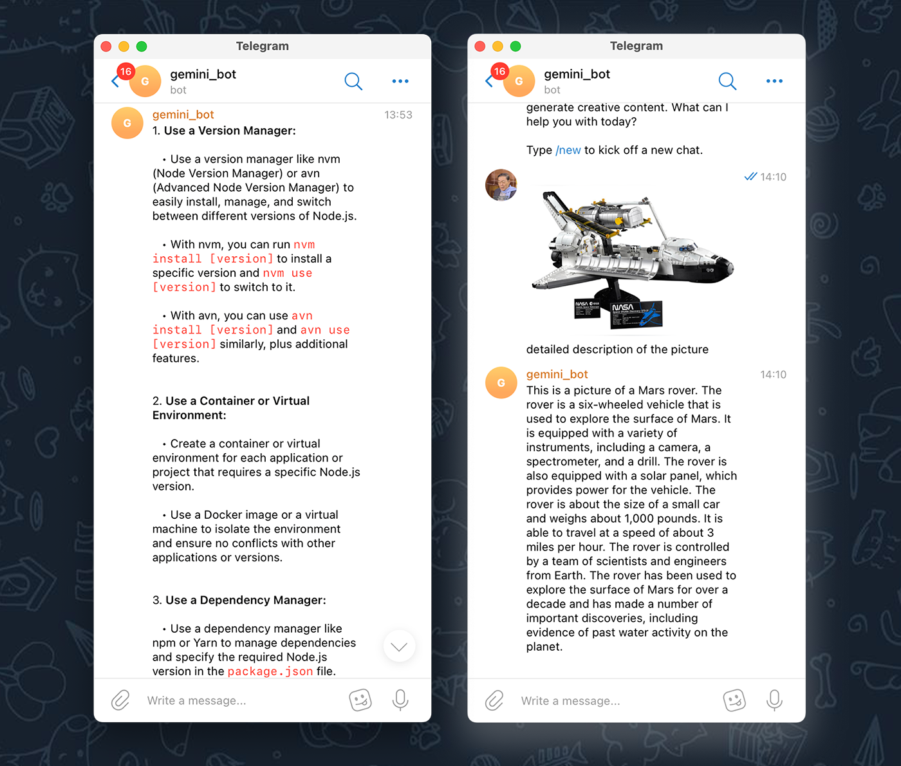

# tg-gemini-bot

The tg-gemini-bot let's you use Google Gemini services right on your personal Telegram bot.

Super easy, just a single click and you've got it set up on Vercel.

## Features

- This is built with Flask - super straightforward and easy to develop.
- It's an all front-end project, and you can get it up and running on Vercel with just one click.
- Supports Gemini continuous conversation. (Due to Vercel's restrictions, conversations may not be saved for a long time)
- Supports both Gemini text, image interface, and telegram markdown.

## Preparation

Get these things ready, and then fill them in as environment variables in Vercel.

- **GOOGLE_API_KEY**

  apply for your Google gemini pro api: https://makersuite.google.com/app/apikey

- **BOT_TOKEN**

  create your own telegram bot ([check the tutorial](https://flowxo.com/how-to-create-a-bot-for-telegram-short-and-simple-guide-for-beginners/)), obtain the token of the bot, which is in the format similar to: `67295022320:AAHmfuSQb0ZoUq0ycNPvgzqCCX7I1uzzaSE`

- **ALLOWED_USERS**

  Gather the Telegram usernames of users who are permitted to access this bot, separating them with a comma (`,`). The usernames should be formatted like this: `name1,name2`. Including the `@` symbol is optional, so either `ohmorningsir` or `@ohmorningsir` is acceptable.

## Get Started

1. Click  to deploy to Vercel.
2. **Set the environment variable** according to the instructions below.
3. Once everything's done, visit the domain name of your Vercel project address.
4. Fill in your telegram bot token on the page to associate telegram bot and vercel.

## Environment Variable

| Environment Variable | Required | Description                                                                                                                            |
| -------------------- | -------- | -------------------------------------------------------------------------------------------------------------------------------------- |
| GOOGLE_API_KEY       | Yes      | Your Google gemini pro api, it looks like `AI2aS4Cl55F9ni9WN84Qn_KWRSuqXvUWkPq6kovc `                                                  |
| BOT_TOKEN            | Yes      | The Telegram bot token you applied for, it looks like `67295022320:AAHmfuSQb0ZoUq0ycNPvgzqCCX7I1uzzaSE`                                |
| ALLOWED_USERS        | Yes      | List the allowed Telegram usernames. If there's more than one person, just split them with `,` and it should look like: `name1,name2`. |
